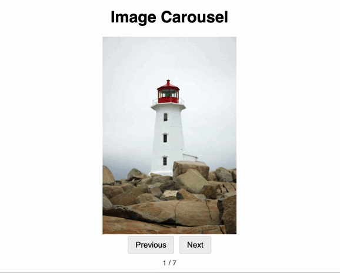

# 🧩 React Image Carousel

A reusable React component that displays a list of images in a carousel, with Previous and Next buttons for manual navigation controls and an automatic-play feature for auto-scrolling.

**Your primary task is to implement the core logic inside the `ImageCarousel.jsx` component file to make it fully functional.**

## ✅ Milestones

| Milestone | Description |
|----------|-------------|
| **1** | **Display Image:** Render the first image from the `imageUrls` prop. It should display "**No images available**" if the `imageUrls` list is empty. |
| **2** | **Manual Navigation:** Implement the "Previous" and "Next" button logic to allow users to navigate through the images. The navigation should be infinite (looping from the last image back to the first, and vice-versa). |
| **3** | **Implement Automatic Advancement:** Introduce an auto-play feature. The carousel should automatically advance to the next image every **3 seconds**. If the user clicks the Previous/Next button at any point, the timer should reset. |
| **4** | **Performance Optimization:** Proactively preload both the *next* and *previous* images in the sequence to ensure smooth, instant transitions without a loading flash. |

---

## Check a working demo here to understand what you need to build:

**GIF Demo:**

